# Phase 5 — Full ERD

A single 76-table diagram is unreadable, so the ERD is split into **per-module** diagrams (each self-contained) plus a **cross-module relationship inventory** that lists every FK that crosses a module boundary. Together they fully specify the data model.

Conventions in diagrams:
- `||--o{` one-to-many (parent has many children)
- `||--||` one-to-one
- `}o--o{` many-to-many
- PK in **bold**, FK marked `(FK)`
- Soft-delete & audit columns omitted for legibility

---

## 5.1 IAM

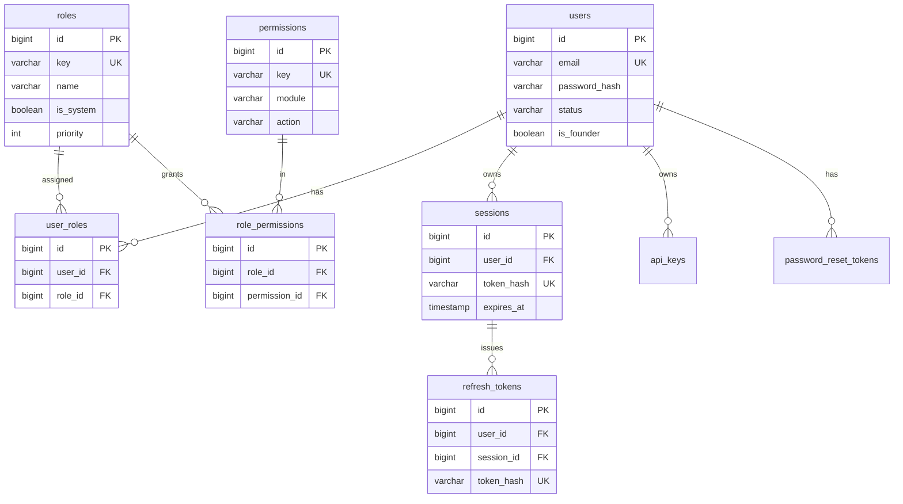

## 5.2 CRM

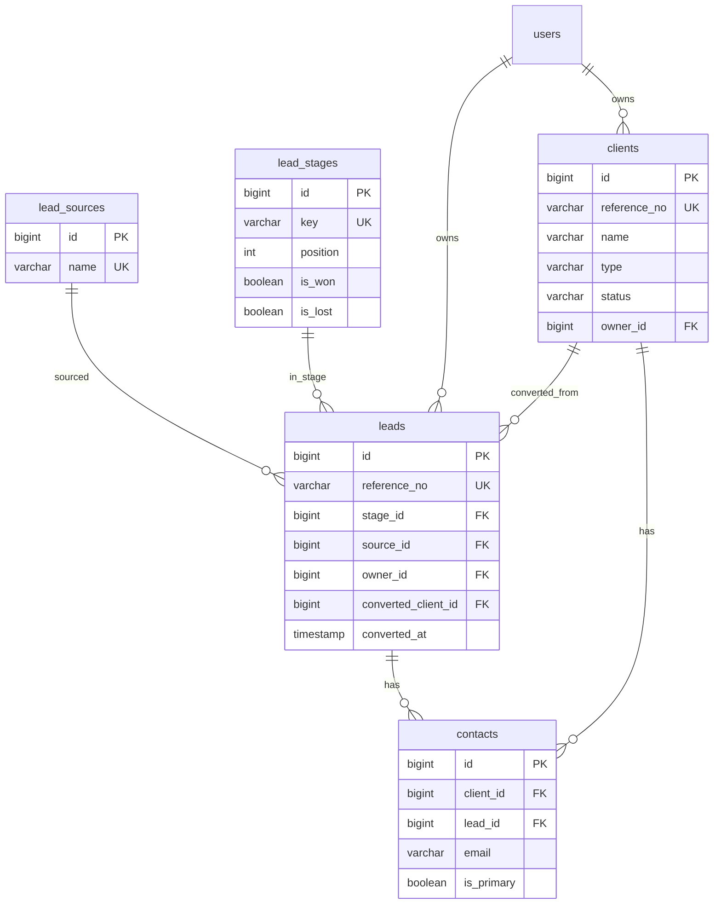

## 5.3 Sales

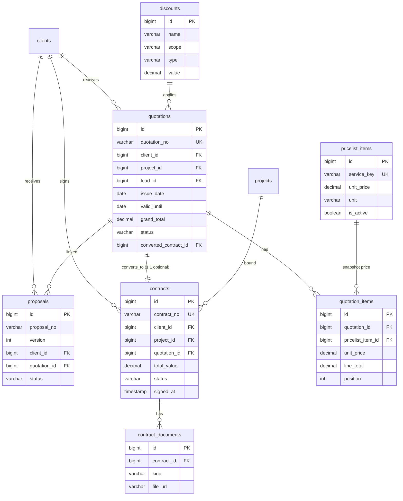

## 5.4 Delivery

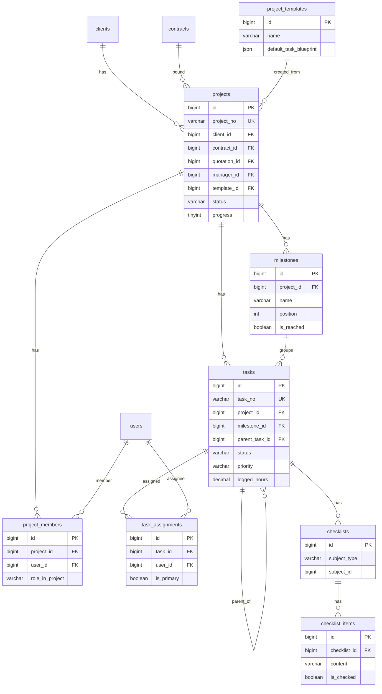

> Note: `checklists.subject_type/subject_id` is polymorphic (task or project). This is an intentional, documented polymorphism — the only polymorphic "ownership" in Delivery.

## 5.5 Finance

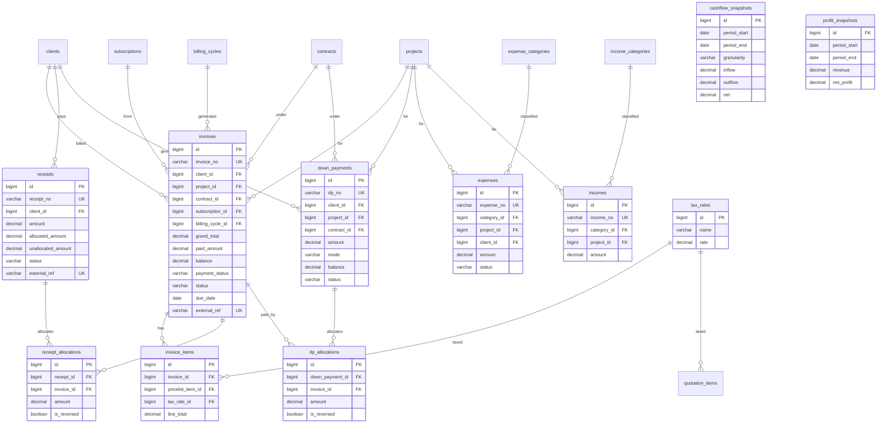

## 5.6 Subscription / Billing

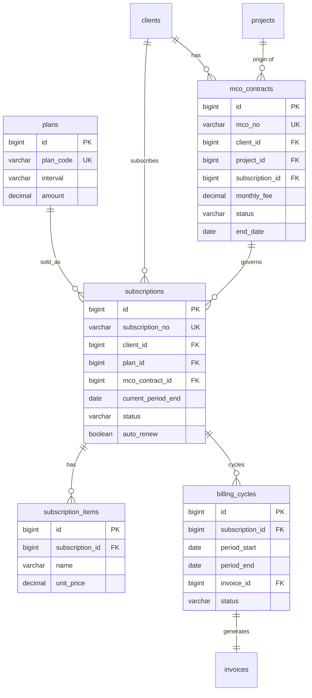

## 5.7 Payroll

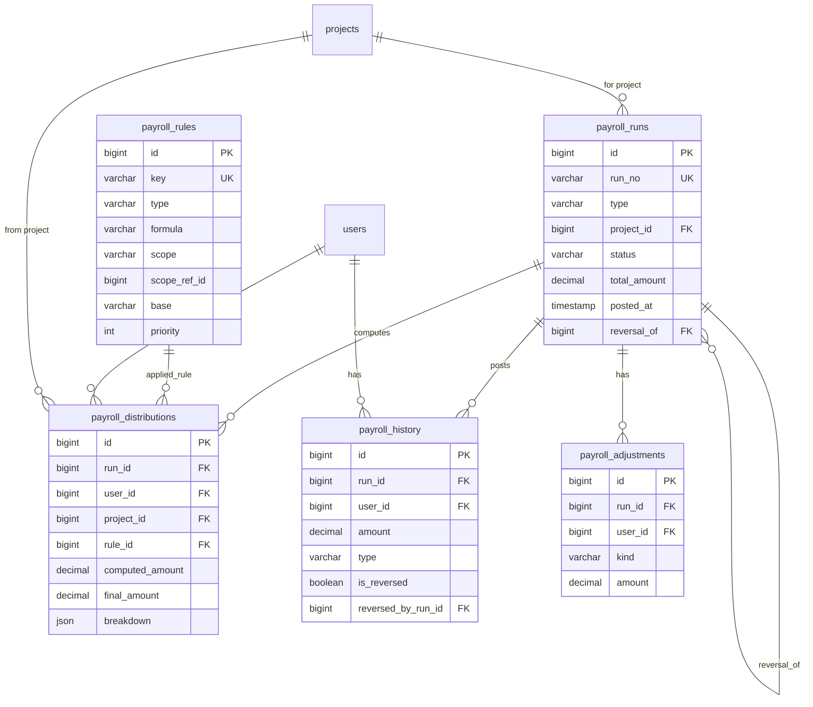

## 5.8 Asset & Maintenance

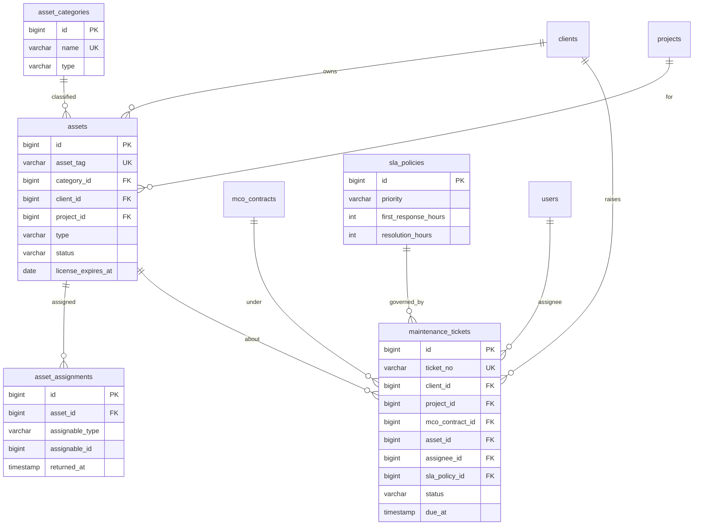

## 5.9 Notification

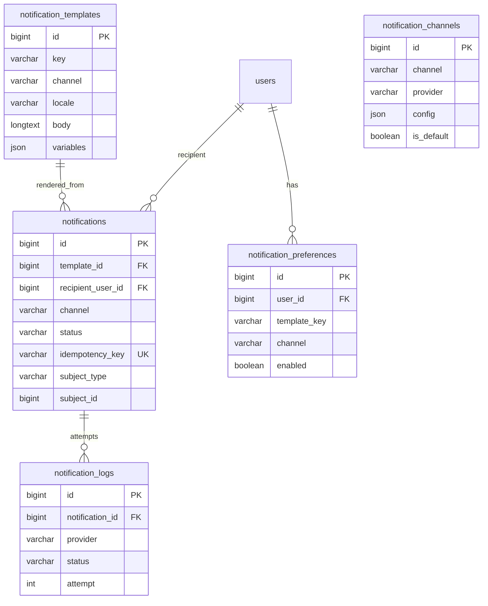

## 5.10 Knowledge Base

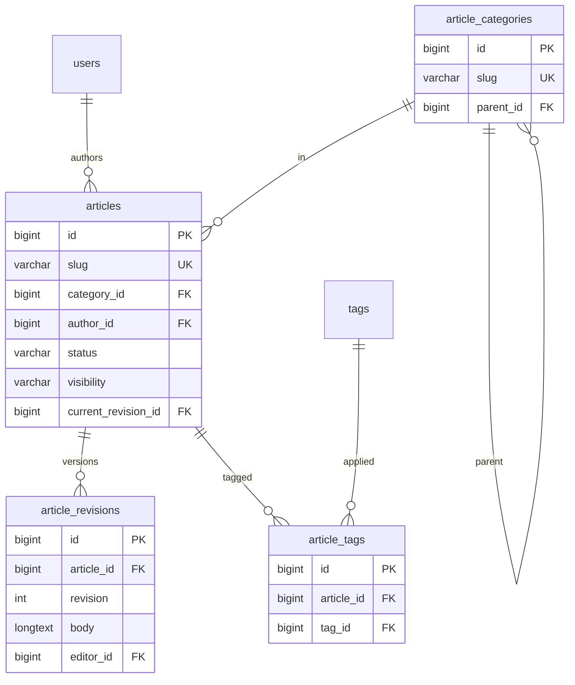

## 5.11 Audit & Activity

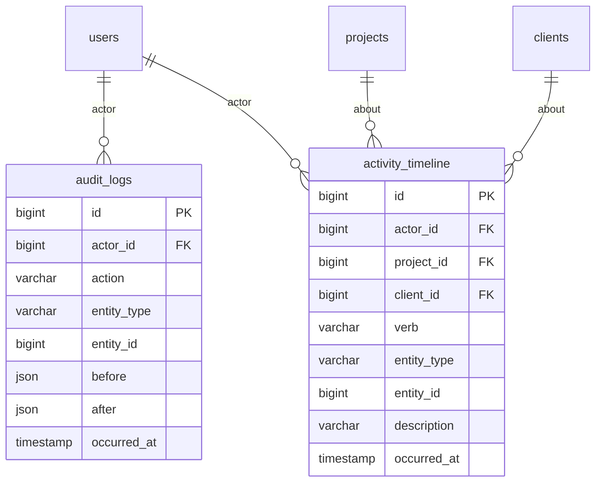

## 5.12 Platform

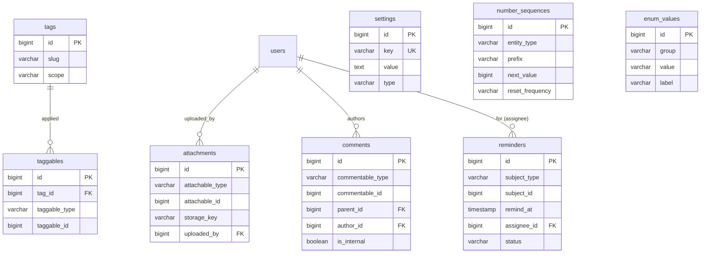

---

## 5.13 Cross-module relationship inventory (every FK that crosses a boundary)

This table is the authoritative list of how modules are wired. Within-module FKs are shown in the diagrams above; this lists **cross-module** links only.

| Child (table.col) | → Parent (table.col) | Child module → Parent module | Cardinality |
|---|---|---|---|
| leads.owner_id | users.id | CRM → IAM | M:1 |
| leads.converted_client_id | clients.id | CRM → CRM | 1:1 |
| clients.owner_id | users.id | CRM → IAM | M:1 |
| contacts.client_id / lead_id | clients/leads | CRM → CRM | M:1 |
| quotations.client_id | clients.id | Sales → CRM | M:1 |
| quotations.project_id | projects.id | Sales → Delivery | M:1 |
| quotations.lead_id | leads.id | Sales → CRM | M:1 |
| quotations.converted_contract_id | contracts.id | Sales → Sales | 1:1 |
| contracts.client_id | clients.id | Sales → CRM | M:1 |
| contracts.project_id | projects.id | Sales → Delivery | M:1 |
| contracts.quotation_id | quotations.id | Sales → Sales | M:1 |
| projects.client_id | clients.id | Delivery → CRM | M:1 |
| projects.contract_id | contracts.id | Delivery → Sales | M:1 |
| projects.quotation_id | quotations.id | Delivery → Sales | M:1 |
| projects.manager_id | users.id | Delivery → IAM | M:1 |
| project_members.user_id | users.id | Delivery → IAM | M:1 |
| task_assignments.user_id | users.id | Delivery → IAM | M:1 |
| invoices.client_id | clients.id | Finance → CRM | M:1 |
| invoices.project_id | projects.id | Finance → Delivery | M:1 |
| invoices.contract_id | contracts.id | Finance → Sales | M:1 |
| invoices.subscription_id | subscriptions.id | Finance → Subscription | M:1 |
| invoices.billing_cycle_id | billing_cycles.id | Finance → Subscription | M:1 |
| receipts.client_id | clients.id | Finance → CRM | M:1 |
| receipt_allocations.invoice_id | invoices.id | Finance → Finance | M:1 |
| down_payments.client_id | clients.id | Finance → CRM | M:1 |
| down_payments.project_id | projects.id | Finance → Delivery | M:1 |
| down_payments.contract_id | contracts.id | Finance → Sales | M:1 |
| dp_allocations.invoice_id | invoices.id | Finance → Finance | M:1 |
| expenses.project_id | projects.id | Finance → Delivery | M:1 |
| expenses.client_id | clients.id | Finance → CRM | M:1 |
| incomes.project_id | projects.id | Finance → Delivery | M:1 |
| incomes.client_id | clients.id | Finance → CRM | M:1 |
| subscriptions.client_id | clients.id | Subscription → CRM | M:1 |
| subscriptions.mco_contract_id | mco_contracts.id | Subscription → Subscription | M:1 |
| mco_contracts.client_id | clients.id | Subscription → CRM | M:1 |
| mco_contracts.project_id | projects.id | Subscription → Delivery | M:1 |
| billing_cycles.invoice_id | invoices.id | Subscription → Finance | 1:1 |
| payroll_runs.project_id | projects.id | Payroll → Delivery | M:1 |
| payroll_distributions.user_id | users.id | Payroll → IAM | M:1 |
| payroll_distributions.project_id | projects.id | Payroll → Delivery | M:1 |
| payroll_history.user_id | users.id | Payroll → IAM | M:1 |
| assets.client_id | clients.id | Asset → CRM | M:1 |
| assets.project_id | projects.id | Asset → Delivery | M:1 |
| maintenance_tickets.client_id | clients.id | Asset → CRM | M:1 |
| maintenance_tickets.project_id | projects.id | Asset → Delivery | M:1 |
| maintenance_tickets.mco_contract_id | mco_contracts.id | Asset → Subscription | M:1 |
| maintenance_tickets.asset_id | assets.id | Asset → Asset | M:1 |
| maintenance_tickets.assignee_id | users.id | Asset → IAM | M:1 |
| notifications.recipient_user_id | users.id | Notification → IAM | M:1 |
| notification_preferences.user_id | users.id | Notification → IAM | M:1 |
| articles.author_id | users.id | Knowledge → IAM | M:1 |
| audit_logs.actor_id | users.id | Audit → IAM | M:1 |
| activity_timeline.actor_id | users.id | Audit → IAM | M:1 |
| activity_timeline.project_id | projects.id | Audit → Delivery | M:1 |
| activity_timeline.client_id | clients.id | Audit → CRM | M:1 |
| (all) *.created_by/updated_by | users.id | * → IAM | M:1 |

**Count of cross-module FKs: ~52.** Every one of these is an intentional, documented coupling. There are **no hidden cross-module table joins** in application code — cross-module reads go through service/API/event boundaries (Phase 2 rule).

---

## 5.14 Polymorphic relationships (explicit list)

Polymorphic associations are used sparingly and **only for genuinely cross-cutting concerns**. Each is listed so the implementation AI never guesses.

| Polymorphic table | Subject columns | Used by |
|---|---|---|
| `taggables` | taggable_type, taggable_id | any entity that supports tags |
| `attachments` | attachable_type, attachable_id | any entity that supports files |
| `comments` | commentable_type, commentable_id | tasks, projects, invoices, tickets, leads, clients, articles |
| `reminders` | subject_type, subject_id | invoice (overdue), mco (renewal), asset (license expiry), task (due) |
| `checklists` | subject_type, subject_id | task, project |
| `asset_assignments` | assignable_type, assignable_id | project, client, user |
| `notifications.subject_*` | subject_type, subject_id | triggering entity |
| `activity_timeline.entity_*` | entity_type, entity_id | any |

**Rules for polymorphic integrity:**
- The `*_type` values are a **closed enum** maintained in `enum_values` group `polymorphic.types` (or code constants). No free-text.
- Cascading deletes on polymorphic subjects are **not** DB-enforced (can't be — no real FK). Instead, a **cleanup job** + **soft-delete cascade hooks** remove or orphan child rows when a subject is deleted. This is documented per-table in the service layer (Phase 19).
- Indexes on `(subject_type, subject_id)` exist on every polymorphic table (see Phase 4).

---

The ERD is now complete: 76 entities, 5 intra-module diagrams, 52 cross-module FKs catalogued, and 8 controlled polymorphic associations.
